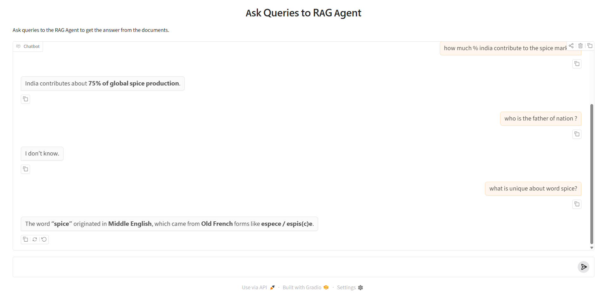

# OpenAI RAG Agent

A small Retrieval-Augmented Generation (RAG) project: documents are turned into embeddings and stored in Chroma, then an agent answers questions using those chunks instead of inventing from memory alone.

**Ingest:** `watch.py` monitors `files/pending`. When a file appears, it is loaded and split into chunks, each chunk is embedded with OpenAI, and the vectors plus metadata are saved in a persistent Chroma store (`emb/`). Successfully processed files are moved to `files/processed`.

**Chat:** `app.py` launches a Gradio UI backed by an OpenAI Agents SDK agent. For document questions, the agent calls a `doc_search` tool that runs similarity search over Chroma and answers from the retrieved content.



## Setup

### Common setup for Ingest and App

```bash
cd agent-openai-rag

python -m venv .venv

# Windows
.venv\Scripts\activate

# macOS / Linux
source .venv/bin/activate

pip install -r requirements.txt

cp .env.example .env
# Edit .env and add your OPENAI_API_KEY
```

### Ingest documents (`watch.py`)

Watches `files/pending`, embeds new files into Chroma, then moves them to `files/processed`.

```bash
python watch.py
```

Drop PDFs or text files into `files/pending` while it is running.

### Chat UI (`app.py`)

Starts the Gradio app so you can ask questions over ingested documents.

```bash
python app.py
```

You can run `watch.py` and `app.py` **in parallel in separate terminals** — ingest in one, chat in the other.
